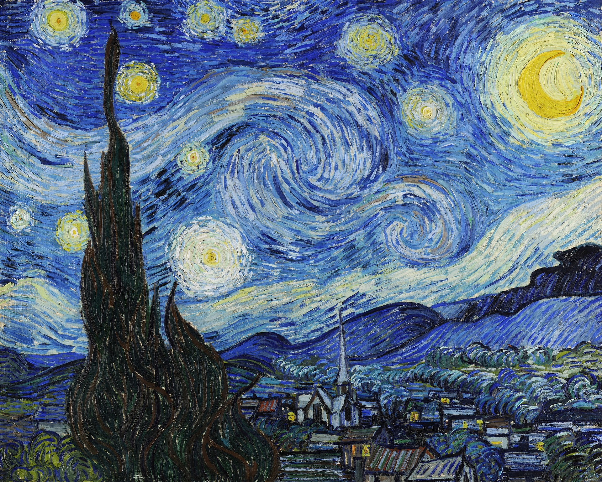
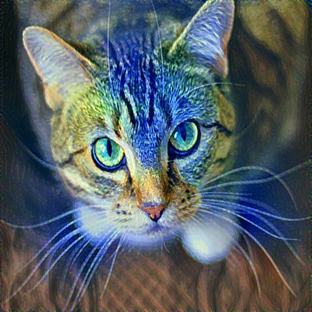
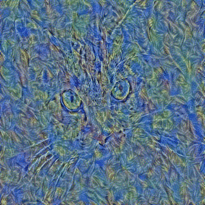
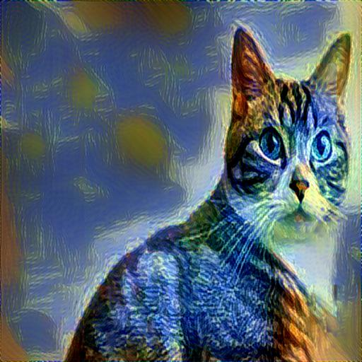
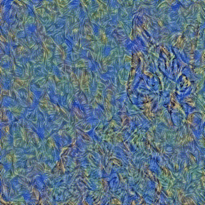
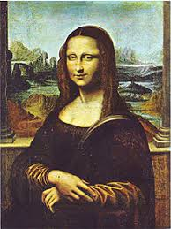
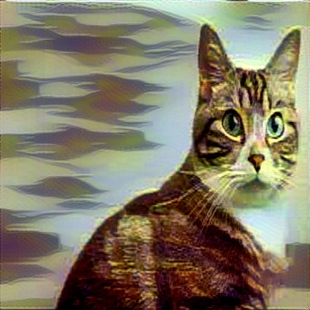
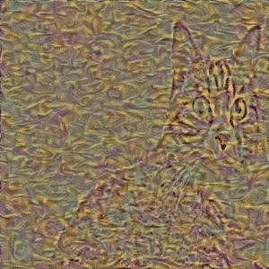
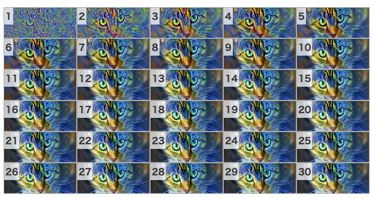

# style_transfer
CNNで画像にスタイルを載せるアレ

#### サンプル

|コンテント|スタイル|出力|gif|
|:-:|:-:|:-:|:-:|
|||||
|||||
|||||

処理中の例



- 結果はわりと画像依存、絵画っぽいのをスタイルに使うのがよさそう  
- 一応30イテレーション回しているけど10も回せば十分感ある  
- 他の人の実行例とか見るに、モデルとかパラメータをもう少し工夫すればもっといい結果を出せるんだと思う  
- 基本Google Colab上で動かしました、一応GPU乗ってないローカルの環境でもテストで動かそうとしたけどとんでもなく時間がかかったので諦めました  

#### 使い方
```
content_image_path = '[コンテント画像のパス]'
style_image_path   = '[スタイル画像のパス]'
output_dir_path    = '[出力先のディレクトリのパス]'
```

#### 説明
- [] 後で詳しく書く

ランダムに初期化された入力を与えて、コンテンツのロス＋スタイルのロスを最小化するように学習を繰り返します  
